# Projeto de Catalogo de filme
**Nome do Projeto:**
**Desenvolvedor** Sanches

## 1. Objetivos do Sistema
Poder avaliar e fazer anotações sobre filmes de forma a deixar organizado e bonito
## 2. Requisitos Funcionais (RF)
**RF01**-- O sistema deve conter sistema de login com usuário e senha. Para fazer o login nesse sistema será necessário: 
 -Nome de usuário
 -Email 
 -senha 
 **RF02** -- O sistema deve permitir cadastro do filme vai ser feito da seguinte maneira, O usuário vai poder colocar para cadastrar o filme:
 -Titulo 
 -Sobre o que fala(opcional)
 -capa do filme 
 -Ano de lançamento 
 -Gênero
 -Uma nota de 0 a 10 que dá par ao filme 
 
 **RF03** -- O sistema deve permitir ser possível editar todos os filmes cadastrados, para editar a nota capa o qualquer informação do filme cadastrado ela vai poder editar, quanto excluir filmes cadastrados também. 
 
 ## 3. Requisitos não funcionais (RNF)
 **RNF01** -- O sistema deve salvar todos os filmes cadastrados E Mostrar eles em ordem de assistido por último, mas os filmes que foram favorito devem aparecer primeiro. 

 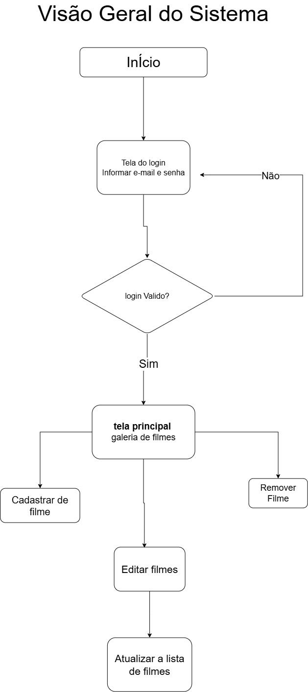
 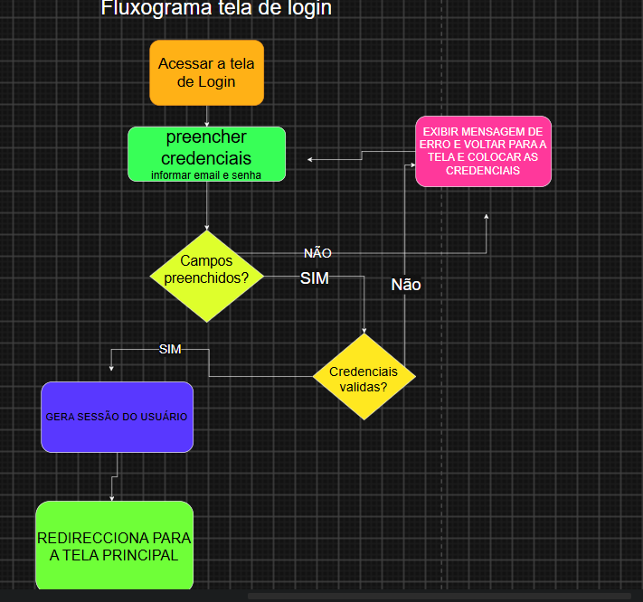
 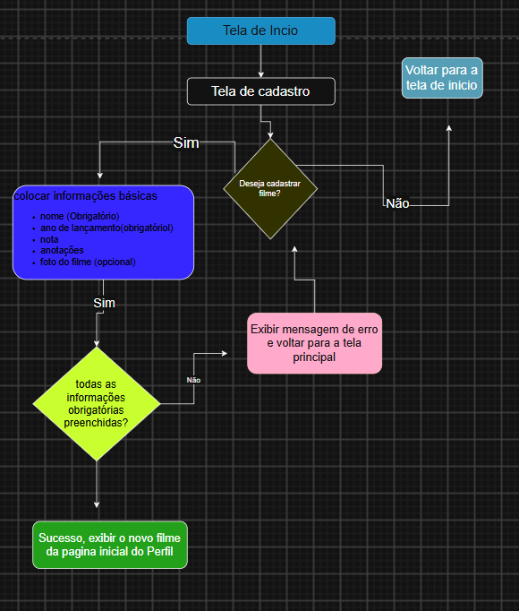
 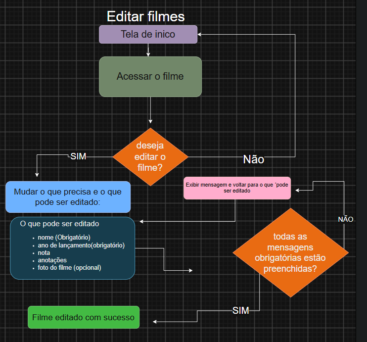
 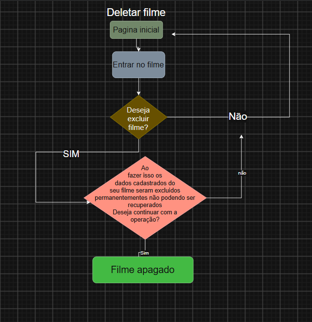

 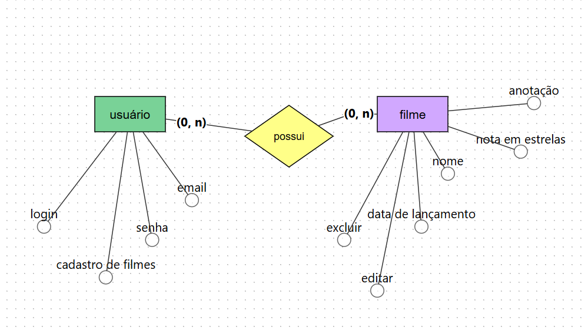

 # prototipos de telas do sistema
 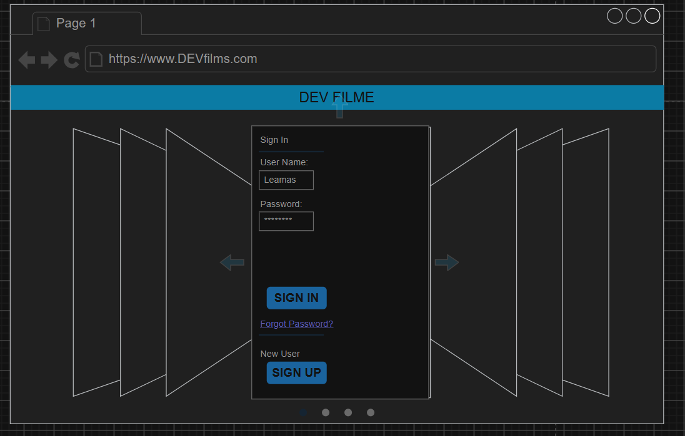
 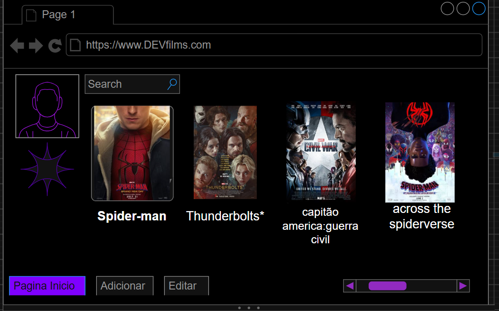
 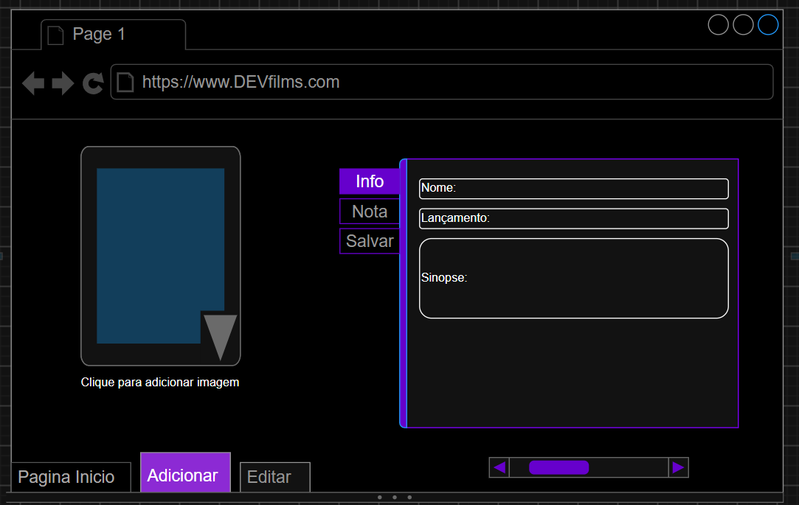
 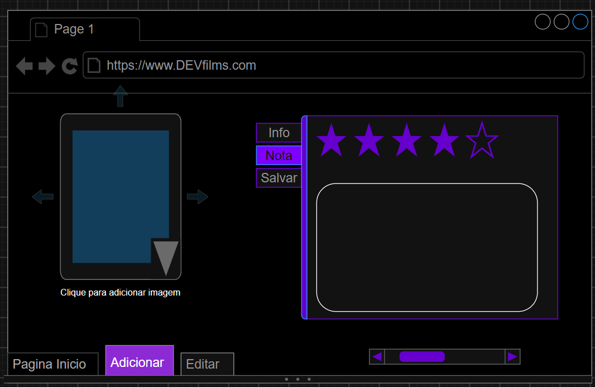
 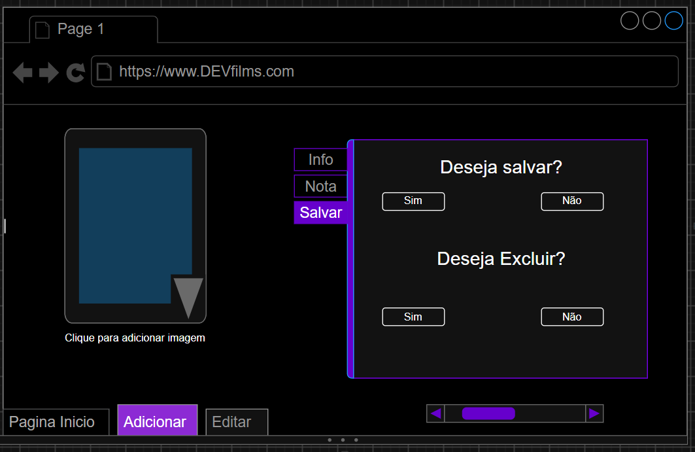
 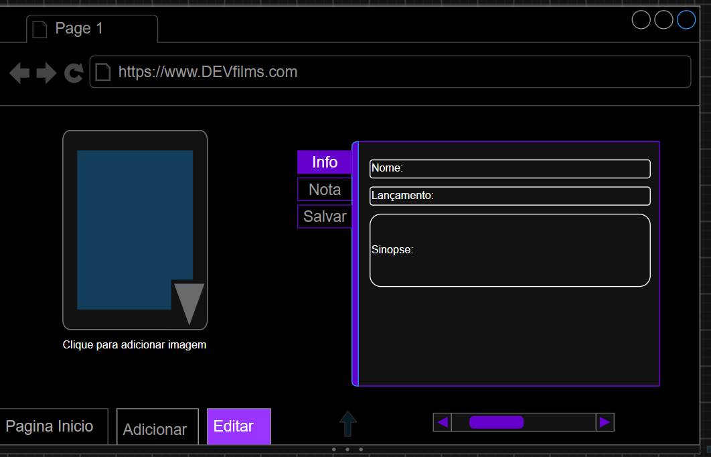

 # modelos do DRAWdb
 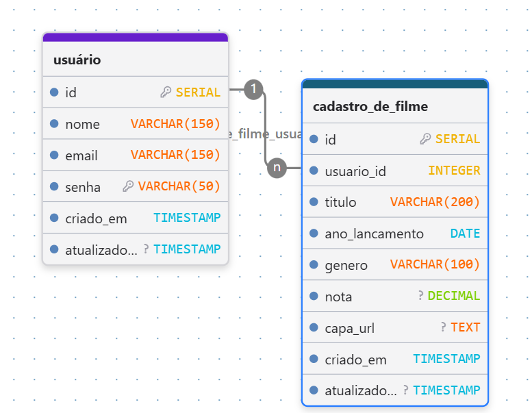
 